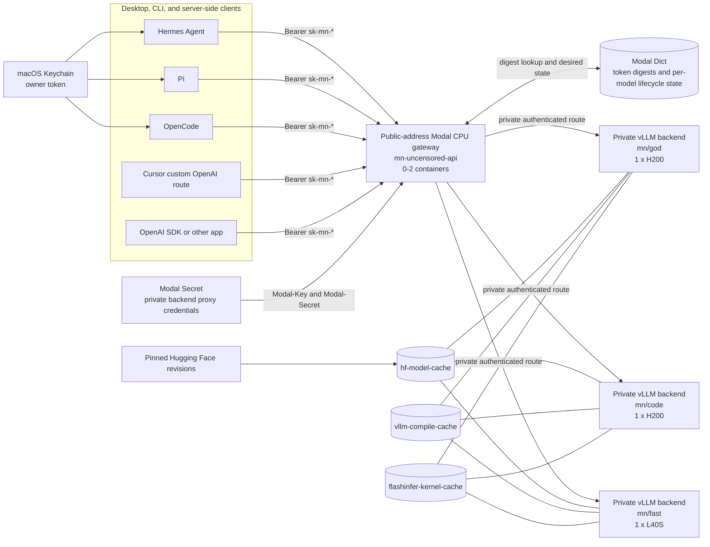
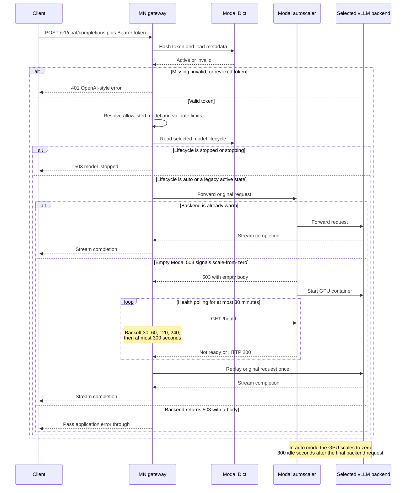
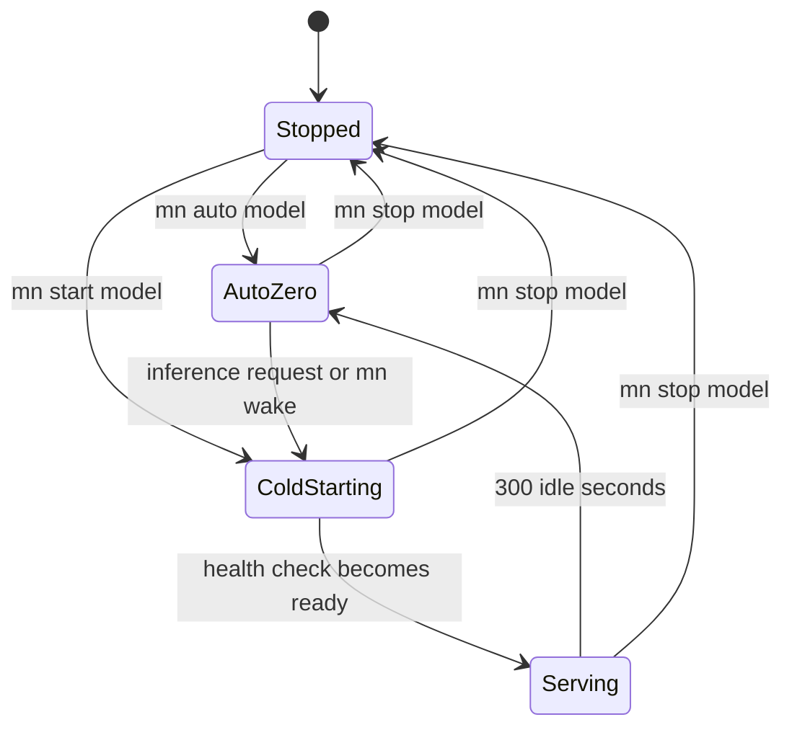
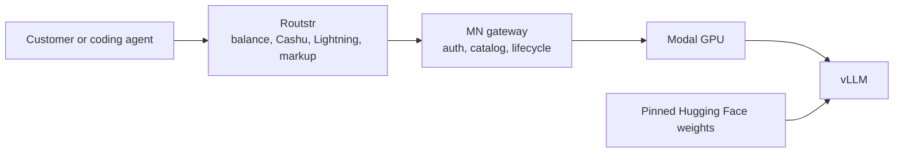
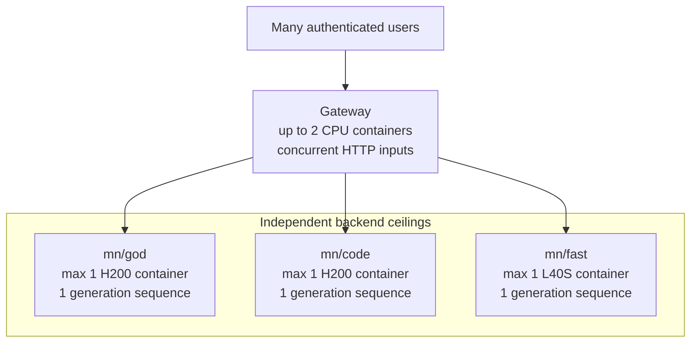
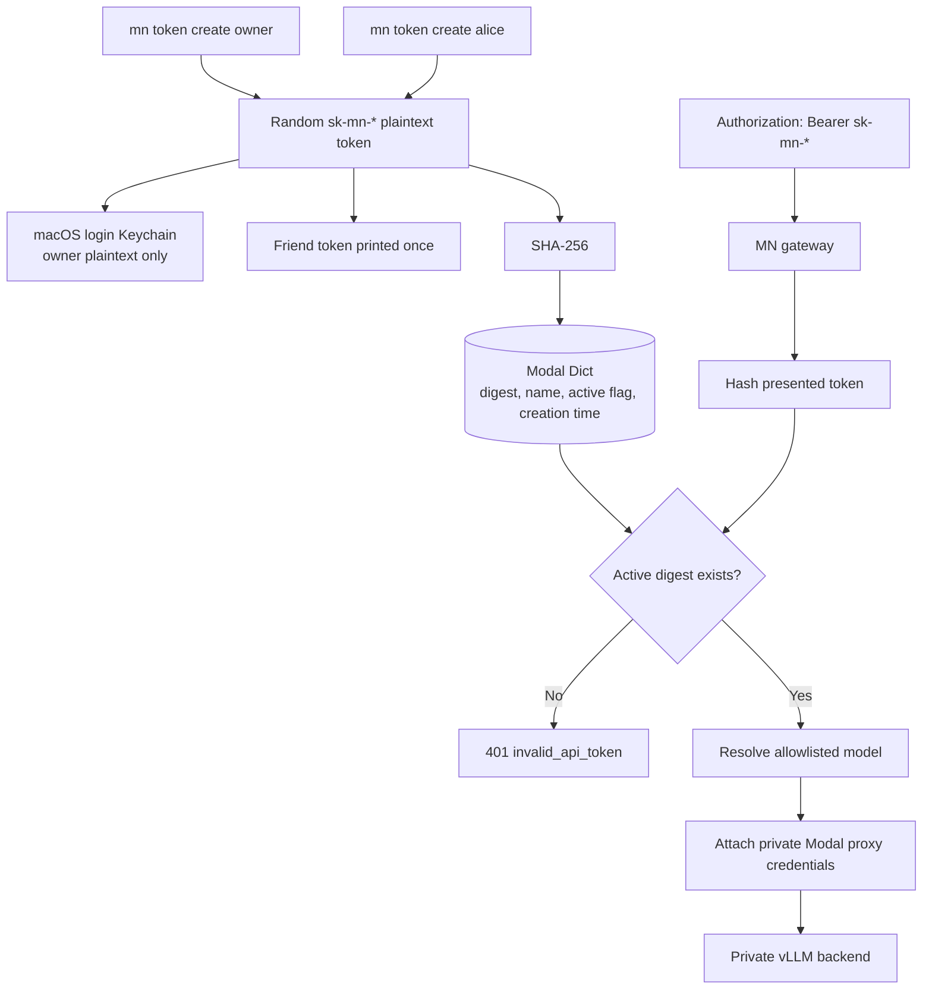
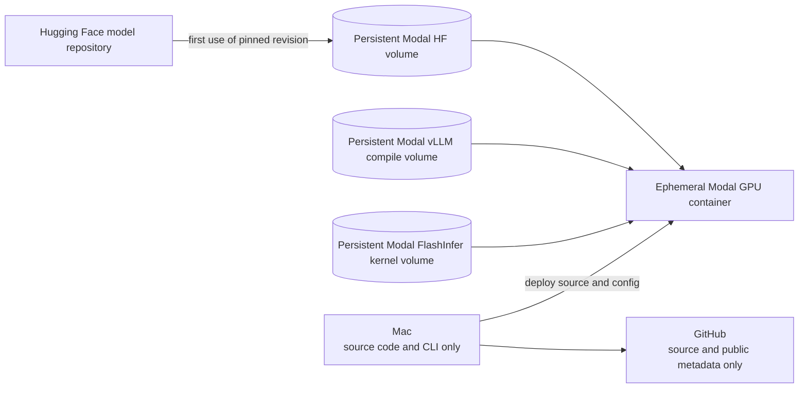
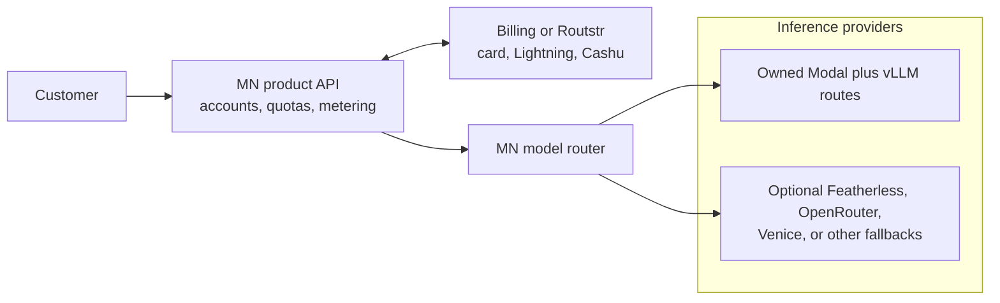

# MN Uncensored

[Public repository](https://github.com/eminogrande/mn-uncensored) ·
[Latest deployed release: v0.3.1](https://github.com/eminogrande/mn-uncensored/releases/tag/v0.3.1) ·
[Release notes](docs/RELEASE_NOTES.md) ·
[Security](SECURITY.md) ·
[Apache-2.0](LICENSE)

MN Uncensored is a small control plane and authenticated,
OpenAI-compatible API for three pinned Hugging Face models. The model servers
run with vLLM on scale-to-zero Modal GPUs. Hermes, Pi, OpenCode, scripts, and
other compatible clients use one base URL and select a public MN model ID.

The source repository is public. The deployed API is not anonymous: every
model request, model listing, lifecycle status request, and wake request
requires a valid `sk-mn-*` Bearer token.

> **Current boundary:** this is a private evaluation service for the owner and
> invited testers. It is not yet a complete multi-tenant resale platform.

> **Cost-safety default:** all model routes are currently hard-stopped. Use
> `mn start MODEL` for one safe session and `mn stop MODEL` immediately after
> use. A normal start can no longer keep a warm GPU indefinitely. Read the
> [2026-07-16 cost incident report](docs/INCIDENT-2026-07-16-MODAL-COST.md).
> The safety changes are on `main` but will not be deployed to Modal until a
> Workspace hard budget is confirmed. Do not restart a model before that.

## Contents

- [What runs where](#what-runs-where)
- [Current model catalog](#current-model-catalog)
- [Architecture](#architecture)
- [How a request starts and stops a model](#how-a-request-starts-and-stops-a-model)
- [Why Modal and vLLM were selected](#why-modal-and-vllm-were-selected)
- [Provider and product comparison](#provider-and-product-comparison)
- [Prices and billing](#prices-and-billing)
- [Capacity and multiple users](#capacity-and-multiple-users)
- [Install and operate the current deployment](#install-and-operate-the-current-deployment)
- [API and client configuration](#api-and-client-configuration)
- [Tokens and security](#tokens-and-security)
- [Cloud storage and local downloads](#cloud-storage-and-local-downloads)
- [Deploying a separate copy](#deploying-a-separate-copy)
- [Troubleshooting](#troubleshooting)
- [Cost incident: what actually happened](#cost-incident-what-actually-happened)
- [Release process and release history](#release-process-and-release-history)
- [Path from private API to resale platform](#path-from-private-api-to-resale-platform)
- [Model and license caveats](#model-and-license-caveats)

## What runs where

The stack consists of separate layers. “Hugging Face”, “vLLM”, and “Modal” are
not interchangeable:

| Layer | Responsibility |
| --- | --- |
| Hugging Face | Stores the model repositories and exact pinned weight revisions |
| Modal | Rents the GPUs, runs containers, stores secrets and volumes, bills compute, and scales containers to zero |
| vLLM | Loads one model on a Modal GPU and exposes its OpenAI-compatible inference server |
| MN gateway | Validates Bearer tokens, resolves model IDs, enforces limits, controls lifecycle state, waits through cold starts, and presents one shared API URL |
| `mn` CLI | Provides start, stop, automatic mode, token management, status, and agent launch commands |
| Hermes, Pi, OpenCode, Cursor, scripts | Consume the API as clients |

[vLLM](https://docs.vllm.ai/en/v0.21.0/serving/openai_compatible_server/)
is therefore the inference engine, not the hosting provider. The selected
hosting combination is **Modal + vLLM**, with model artifacts sourced from
Hugging Face.

## Current model catalog

All runtime artifacts and revisions are versioned in
[`config/mn.json`](config/mn.json). Model names such as “abliterated” describe
the upstream artifact; they are not a guarantee of zero refusals.

| MN ID | Exact Hugging Face artifact | GPU | Context | Maximum output | Modal base GPU price |
| --- | --- | --- | ---: | ---: | ---: |
| `mn/god` | [`huihui-ai/Huihui-Qwen3.6-35B-A3B-abliterated`](https://huggingface.co/huihui-ai/Huihui-Qwen3.6-35B-A3B-abliterated) | 1 × H200 | 131,072 | 16,384 | $4.5396/hour |
| `mn/code` | [`YuYu1015/YuYu1015-Ornith-1.0-35B-abliterated`](https://huggingface.co/YuYu1015/YuYu1015-Ornith-1.0-35B-abliterated) | 1 × H200 | 131,072 | 16,384 | $4.5396/hour |
| `mn/fast` | [`huihui-ai/Huihui-Qwythos-9B-Claude-Mythos-5-1M-abliterated`](https://huggingface.co/huihui-ai/Huihui-Qwythos-9B-Claude-Mythos-5-1M-abliterated) | 1 × L40S | 131,072 | 16,384 | $1.9512/hour |

The full 40-character pins, attribution chain, runtime substitutions, and
license caveats are documented in [docs/MODELS.md](docs/MODELS.md).

### Current verified deployment state

Checked on 2026-07-16:

- the public gateway health endpoint returned `{"status":"ok"}`;
- all three model lifecycle records were hard-stopped;
- the deployed `god`, `code`, and `fast` applications each reported zero
  running tasks;
- no API request can wake a hard-stopped model;
- release `v0.3.1` had previously passed one streaming completion and one
  forced tool call on every route.

The gateway itself may briefly keep a small CPU container after a health or API
request. That is separate from the H200/L40S model containers.

The latest deployed runtime remains `v0.3.1`. The five-minute safety release is
intentionally pending until the Modal Workspace hard budget is set.

### Why there is no current 397B route

The original target was a very large Ornith 397B abliterated model. That was
useful for exploring the upper end of capability, but it was a poor first
product:

- it requires much more GPU memory and likely multiple expensive GPUs;
- cold starts and weight loading become substantially longer;
- one personal request can create a large minimum activation bill;
- the first platform version needs reliable routing, tokens, lifecycle control,
  client compatibility, and cost visibility more than maximum parameter count.

The first practical catalog was therefore changed to two 35B-class routes and
one 9B route. This allows the full system to be tested without making every
experiment a multi-GPU event.

The migration alias `nuri/ornith-397b-abliterated` currently resolves to
`mn/god`. It exists only so an old client does not wake a second legacy
backend. It does **not** mean a 397B model is currently deployed.

## Architecture



The gateway URL is public because clients must be able to reach it. The GPU
backend URLs are also not treated as secrets, but Modal rejects requests that
do not contain the separate private proxy credential pair.

## How a request starts and stops a model

Each model has an independent lifecycle. Calling `mn/god` does not start
`mn/code` or `mn/fast`.



### Lifecycle modes



The operational modes are:

| Mode | Command | Minimum containers | Behavior |
| --- | --- | ---: | --- |
| Safe start | `mn start code` | 0 | Arms `mn/code`, wakes it once, and scales to zero after five idle minutes |
| Automatic | `mn auto code` | 0 | Arms `mn/code` without immediately starting a GPU; the next inference request wakes it |
| Hard-stopped | `mn stop code` | 0 | Route fails closed; an API request cannot wake it |

`mn stop` without a model hard-stops all three routes. `mn start`, `mn auto`,
and `mn wake` require an explicit model so an accidental command cannot arm or
start the whole catalog.

Five idle minutes is not a five-minute maximum charge. Startup, weight loading,
kernel compilation, queued work, an active generation, an open stream, health
checks, and new client requests are activity. The idle countdown begins only
after that activity ends. The Modal Workspace hard budget remains the real
outer spending limit.

## Why Modal and vLLM were selected

The goal was not merely to call somebody else’s API. The goal was to own:

- the exact Hugging Face artifacts and revisions;
- the public model names;
- the OpenAI-compatible base URL;
- token issuance and revocation;
- cold-start and shutdown behavior;
- the serving configuration and context limits;
- the path toward later metering and resale.

Modal was selected as the initial GPU host because it provides per-second
resource billing, programmable scale-to-zero, persistent volumes, secrets, and
Python-controlled deployment. vLLM was selected because it is an efficient
open inference server with an OpenAI-compatible interface and tool-calling
support.

MN adds the product-facing layer that neither component provides by itself:
one branded catalog, friend tokens, strict routing, lifecycle controls,
cold-start waiting, and client launchers.

### The practical conclusion from the provider discussion

- **Cheapest for occasional personal calls:** a token-priced service such as
  Featherless can be cheaper when it already serves the desired model.
- **Best for the exact owned three-model service:** Modal + vLLM gives control
  over revisions, context, parsers, caches, model names, and authentication.
- **Best future Bitcoin payment layer:** Routstr could sit in front of MN, but
  it does not replace the GPU host.
- **Best UX inspiration:** Ollama’s launch experience is excellent, which is
  why `mn launch` configures coding tools automatically.

## Provider and product comparison

Prices and product facts in this section were checked on **2026-07-16**.
Provider prices and terms can change; follow the linked primary source before
making a purchasing or resale decision.

| Option | What it actually provides | Exact arbitrary HF pin | Scale to zero | Billing style | Fit for MN |
| --- | --- | ---: | ---: | --- | --- |
| **Modal + vLLM** | Programmable GPU hosting plus our own inference server | Yes | Yes, configured here at 5 idle minutes | Resource-seconds | Selected foundation |
| **Hugging Face Inference Endpoints** | Managed dedicated endpoint with selectable engines and hardware | Yes | Yes | Instance-minutes | Simpler alternative, less custom control |
| **Featherless** | Large shared catalog through one hosted API | Only when cataloged | Provider-managed | Subscription or tokens | Cheapest light testing for supported models |
| **OpenRouter** | Router across many existing providers | No arbitrary deployment | Provider-dependent | Tokens plus platform fee | Excellent model evaluation and fallback |
| **Venice** | Finished privacy/uncensored-oriented hosted API | No arbitrary deployment | Provider-managed | Tokens or plan credits | Competitor and price benchmark |
| **Ollama local/cloud** | Local runtime and curated cloud access with strong CLI UX | Local imports vary; cloud cataloged | Local lifecycle or provider-managed | Own hardware or subscription | UX inspiration, not our cloud host |
| **Routstr** | OpenAI proxy with Cashu/Lightning balances and reseller markup | Uses an upstream | Not a GPU host | Per request/token in sats | Potential future payment layer |
| **LNVPS** | Bitcoin/Lightning-paid CPU VPS | Files can be hosted, but no listed GPU | No serverless GPU | Monthly VPS | Possible cheap control plane, not model inference |

### Modal

[Modal’s pricing page](https://modal.com/pricing) lists H200 at
`$0.001261/second` and L40S at `$0.000542/second`. The Starter plan currently
includes `$30/month` of compute credit. Modal provides the GPUs, containers,
secrets, and volumes; this repository provides vLLM and the gateway.

This is the best fit when exact model control matters more than eliminating all
infrastructure work.

### Hugging Face Inference Endpoints

[Hugging Face endpoint pricing](https://huggingface.co/docs/inference-endpoints/pricing)
currently lists AWS H200 at `$5.00/hour` and AWS L40S at `$1.80/hour`, billed
by the minute while initializing and running.

Hugging Face supports vLLM and scale-to-zero. Its
[autoscaling documentation](https://huggingface.co/docs/inference-endpoints/autoscaling)
warns that a scaled-to-zero endpoint returns `502 Bad Gateway` while starting
and currently has no request queue. A client or gateway must therefore handle
the cold start. MN already implements that control path for Modal.

HF Endpoints are a strong alternative when a managed UI and conventional
dedicated endpoint are more important than a custom control plane.

### Featherless

[Featherless plans](https://featherless.ai/docs/plans) currently start at
`$25/month`; business request pricing starts with prepaid credits and charges
successful requests by token according to the
[request-pricing documentation](https://featherless.ai/docs/request-pricing-and-credits).

At the time of review:

| Artifact | Featherless status | Advertised context | Input / 1M | Output / 1M |
| --- | --- | ---: | ---: | ---: |
| `huihui-ai/Huihui-Qwen3.6-35B-A3B-abliterated` | Available | 32,768 | $1.06 | $2.60 |
| `huihui-ai/Huihui-Qwythos-9B-Claude-Mythos-5-1M-abliterated` | Available | 32,768 | $0.431 | $1.12 |
| `YuYu1015/YuYu1015-Ornith-1.0-35B-abliterated` | Not found in catalog | — | — | — |

Official live records:
[Qwen3.6 35B](https://api.featherless.ai/v1/models/huihui-ai%2FHuihui-Qwen3.6-35B-A3B-abliterated) ·
[Qwythos 9B](https://api.featherless.ai/v1/models/huihui-ai%2FHuihui-Qwythos-9B-Claude-Mythos-5-1M-abliterated)

Featherless is likely cheaper for light personal use of the two supported
artifacts. It is not currently a complete replacement for MN because the exact
Ornith route was unavailable, the reviewed context was 32K rather than the
configured MN 131K, and MN would lose control over the serving revision,
runtime configuration, lifecycle, and backend.

Do not place a paid resale gateway in front of a consumer plan without
confirming that the provider contract explicitly permits it.

### OpenRouter

[OpenRouter pricing](https://openrouter.ai/pricing) currently describes a
pay-as-you-go router across hundreds of models and providers with a 5.5%
platform fee. It is excellent for testing many existing APIs and receiving
provider fallbacks.

It does not deploy the arbitrary pinned Hugging Face repositories in this
catalog, so using OpenRouter would make MN a reseller of somebody else’s model
selection rather than the operator of its own inference backend.

### Venice

[Venice’s API pricing](https://docs.venice.ai/overview/pricing) provides a
useful benchmark for finished privacy- and uncensored-oriented APIs. Venice is
already a hosted service with token pricing and an OpenAI-compatible
interface. It is a product competitor and possible upstream, not the host for
these exact three pins.

### Ollama

[Ollama pricing](https://ollama.com/pricing) currently lists Free, Pro at
`$20/month`, and Max at `$100/month`. Ollama is excellent for running models on
owned hardware and for configuring development tools. Its cloud service uses a
provider-managed catalog and usage allowances.

MN deliberately does not download these 35B models to the Mac. The useful idea
taken from Ollama is the launch experience:

```sh
mn start fast
mn launch --model fast pi
mn stop fast
```

### Routstr

[Routstr](https://docs.routstr.com/) is not a GPU host. It is an
OpenAI-compatible proxy and payment system designed for operators who want to
resell upstream inference or monetize hardware with Cashu/Lightning.

Its [pricing engine](https://docs.routstr.com/provider/pricing/) supports
upstream cost pass-through, an exchange-rate buffer, operator margin,
per-model overrides, minimum charges, and verifiable cost headers.

A later architecture could be:



Routstr would add customer balances and payment, while Modal would still host
vLLM. Its database, wallet backups, accounting, security, and GPL-3.0 license
implications require review before integration.

### LNVPS

[LNVPS](https://lnvps.com/) currently advertises a 4-vCPU, 4-GB RAM,
160-GB SSD VPS for `€13.80/month`, paid through Bitcoin Lightning. No GPU
product is listed.

That VPS cannot run the current 9B/35B GPU models. It could later host an
always-on website, reverse proxy, Routstr node, or other lightweight control
plane while Modal supplies the GPUs.

## Prices and billing

### Modal base GPU prices

These calculations use the official Modal rates checked on 2026-07-16. They
exclude CPU, memory, storage beyond included allowance, network, taxes, and
future price changes.

| Route | GPU | Per second | Per minute | Per hour | Five-minute idle tail |
| --- | --- | ---: | ---: | ---: | ---: |
| `mn/god` | H200 | $0.001261 | $0.07566 | $4.5396 | $0.3783 |
| `mn/code` | H200 | $0.001261 | $0.07566 | $4.5396 | $0.3783 |
| `mn/fast` | L40S | $0.000542 | $0.03252 | $1.9512 | $0.1626 |
| All three simultaneously | — | $0.003064 | $0.18384 | $11.0304 | $0.9192 |

The rough GPU formula is:

```text
estimated GPU cost =
  (startup seconds + inference seconds + billable idle seconds)
  × GPU price per second
```

Examples:

| Example | Approximate base GPU cost |
| --- | ---: |
| One H200 model active for 1 minute | $0.07566 |
| One H200 five-minute idle tail | $0.3783 |
| `mn/fast` five-minute idle tail | $0.1626 |
| All three five-minute idle tails | $0.9192 |
| All three active continuously for one hour | $11.0304 |
| All three active continuously for 730 hours | $8,052.19 |

The five-minute column is not a fixed request price. It illustrates only the
final idle tail after the last backend activity. A real activation also
includes startup, compilation, queued work, and generation time.

Modal currently lists `$30/month` of Starter compute credit. Ignoring all
other resources, that is approximately:

- 6.61 H200 GPU-hours; or
- 15.38 L40S GPU-hours.

See [Modal pricing](https://modal.com/pricing) and
[Modal billing](https://modal.com/docs/guide/billing) for current rates and
billable-resource definitions.

### Does the price increase when more people use it?

Not automatically per person. Modal charges the resources that are running,
not a separate seat fee for every API token.

If one H200 container is already active, two people sharing it do not create
two H200 bills because this deployment caps that backend at one container.
However, additional users can:

- keep the GPU running longer;
- continually reset the five-minute idle timer;
- cause requests to queue;
- increase latency;
- wake different catalog models at the same time.

The practical cost is therefore driven by active GPU time, not merely user
count. A busy group can turn an occasional serverless endpoint into an
effectively always-on GPU.

## Capacity and multiple users

Each model backend currently has:

- `max_containers=1`;
- one configured GPU;
- `max_num_seqs=1`;
- a 16,384-token output ceiling.



Multiple clients may connect, but generations sent to the same model may
serialize or queue. Different models can run simultaneously. This is suitable
for controlled testing, not a high-throughput public service.

Before public multi-user access, measure:

- time to first token and tokens per second;
- queue time at realistic prompt sizes;
- memory behavior at long context;
- tool-call reliability;
- failure recovery;
- cost per successful request;
- per-token and per-customer fairness.

## Install and operate the current deployment

These commands operate the already configured MN deployment from this
repository on the owner’s Mac.

### Install the CLI

```sh
./scripts/install-macos.sh
```

The script runs `uv sync` and symlinks the `mn` command into
`~/.local/bin/mn`.

### Show the menu

```sh
mn
```

The menu provides start, auto, stop, status, agent launch, token, and API
actions.

### Safest default

```sh
mn stop
mn status
```

This leaves every route fail-closed. No client can wake a GPU.

### One safe session

Start with the inexpensive route:

```sh
mn start fast
```

Use the API or an agent, then stop it explicitly:

```sh
mn stop fast
```

`mn start fast` first enforces `min_containers=0`, wakes the route, and leaves
it with a five-minute idle shutdown. The explicit stop is still recommended;
it closes the route immediately instead of waiting for the idle timer.

### Operate individual models

```sh
mn status code
mn wake code
mn start code
mn auto code
mn stop code
```

### Operate all models

```sh
mn status
mn stop
```

To arm several models, name them separately:

```sh
mn auto god
mn auto code
mn auto fast
```

### Command reference

| Command | Result |
| --- | --- |
| `mn` | Interactive menu |
| `mn status [model]` | Show desired lifecycle, GPU ceiling, context, and API URL |
| `mn api [model]` | Print API base URL and model IDs |
| `mn auto MODEL` | Arm one route for request-triggered start and five-minute idle shutdown |
| `mn wake MODEL` | Explicitly wait until one automatic route is ready |
| `mn start MODEL` | Safely arm and wake one model; never keep `min_containers=1` |
| `mn stop [model]` | Hard-stop one model; without a model, stop all |
| `mn token create NAME` | Create a named API token |
| `mn token list` | List token names and creation times |
| `mn token revoke NAME` | Revoke one token immediately |
| `mn token copy owner` | Copy the Keychain-backed owner token |
| `mn launch --model MODEL TOOL` | Launch an armed model, waking it if needed |

Valid selectors are `god`, `code`, `fast`, and their public IDs
`mn/god`, `mn/code`, and `mn/fast`.

## API and client configuration

### Base connection values

```text
Base URL: https://eminhenri--mn-uncensored-api-api.modal.run/v1
API key:  a valid sk-mn-* token
Models:   mn/god, mn/code, mn/fast
```

The tested interface is OpenAI Chat Completions, including streaming and tool
calls. `/v1/models` is also supported. Do not assume complete parity with
every OpenAI endpoint or every proprietary client feature.

### cURL

```sh
curl "https://eminhenri--mn-uncensored-api-api.modal.run/v1/chat/completions" \
  -H "Authorization: Bearer $MN_API_TOKEN" \
  -H "Content-Type: application/json" \
  -d '{
    "model": "mn/code",
    "messages": [
      {"role": "user", "content": "Explain this repository briefly."}
    ],
    "max_tokens": 200,
    "stream": false
  }'
```

### Python OpenAI SDK

```python
import os
from openai import OpenAI

client = OpenAI(
    base_url="https://eminhenri--mn-uncensored-api-api.modal.run/v1",
    api_key=os.environ["MN_API_TOKEN"],
    timeout=60 * 60,
    max_retries=0,
)

response = client.chat.completions.create(
    model="mn/code",
    messages=[
        {"role": "user", "content": "Say MN API OK in one short sentence."}
    ],
    max_tokens=80,
)

print(response.choices[0].message.content)
```

The long timeout is intentional because a cold 35B backend can take several
minutes to download, load, or compile.

### Tool calling

The release smoke test forces one tool call on every route. A client should use
the normal OpenAI `tools` and `tool_choice` fields.

```python
response = client.chat.completions.create(
    model="mn/code",
    messages=[
        {"role": "user", "content": "Call echo with value catalog-ok."}
    ],
    tools=[
        {
            "type": "function",
            "function": {
                "name": "echo",
                "description": "Echo a value.",
                "parameters": {
                    "type": "object",
                    "properties": {"value": {"type": "string"}},
                    "required": ["value"],
                    "additionalProperties": False,
                },
            },
        }
    ],
    tool_choice={"type": "function", "function": {"name": "echo"}},
    max_tokens=256,
)
```

### Qwen thinking

Thinking is disabled by default so clients that only consume the standard
OpenAI `content` field do not receive an apparently empty answer. A direct
client can opt in:

```json
{
  "chat_template_kwargs": {
    "enable_thinking": true
  }
}
```

Clients must know how to consume the model-specific reasoning field before
enabling this.

### Hermes Agent

```sh
mn start code
mn launch --model code hermes --yolo
mn stop code
```

The launcher:

1. checks that the selected lifecycle is armed for automatic use;
2. reads the owner token from the macOS Keychain;
3. wakes the model if it is in automatic mode;
4. configures the Hermes `mn-uncensored` custom provider;
5. sets a 2,700-second request and stale timeout;
6. starts Hermes with the selected MN model.

### Pi

```sh
mn start fast
mn launch --model fast pi
mn stop fast
```

The launcher injects `MN_API_TOKEN`, selects the tracked Pi configuration in
`config/pi-agent`, and starts Pi with provider `mn`.

### OpenCode

```sh
mn start code
mn launch --model code opencode
mn stop code
```

The launcher builds an in-memory OpenCode configuration using
`@ai-sdk/openai-compatible`. It does not write the token into a tracked config
file.

Manual equivalent:

```json
{
  "$schema": "https://opencode.ai/config.json",
  "model": "mn/code",
  "provider": {
    "mn": {
      "name": "MN Uncensored",
      "npm": "@ai-sdk/openai-compatible",
      "options": {
        "apiKey": "{env:MN_API_TOKEN}",
        "baseURL": "https://eminhenri--mn-uncensored-api-api.modal.run/v1"
      },
      "models": {
        "code": {
          "name": "MN Code",
          "limit": {
            "context": 131072,
            "output": 16384
          }
        }
      }
    }
  }
}
```

### Cursor

Cursor compatibility is more limited than a generic OpenAI SDK. Cursor
officially documents bring-your-own keys for supported providers, while custom
base URL behavior and custom model support can change between versions.
Specialized features such as tab completion may continue using Cursor’s own
models.

If the installed Cursor version offers **Override OpenAI Base URL**, use:

```text
OpenAI API key: an MN named token
Override URL:   https://eminhenri--mn-uncensored-api-api.modal.run/v1
Model name:     mn/code
```

Treat Cursor as a compatibility target, not as proof of complete Cursor feature
parity. Hermes, Pi, OpenCode, cURL, and the OpenAI SDK are the directly
configured/tested paths.

### Browser applications and CORS

The current gateway intentionally has no permissive CORS middleware. Desktop,
CLI, and server-side clients can call it. A browser-only frontend on another
origin may be blocked by the browser even with a valid token.

A production web application should call MN through its own server-side
backend rather than exposing a long-lived API token to browser JavaScript.

## Tokens and security

### Create tokens

Create the owner token once:

```sh
mn token create owner
```

The plaintext owner token is stored in the macOS login Keychain under
`mn-uncensored-owner-token`.

Create a separate token for every friend or test client:

```sh
mn token create alice
mn token create cursor-test
mn token list
```

A non-owner token is printed once. Save it in the intended client immediately.
The service cannot recover its plaintext later.

### Revoke tokens

```sh
mn token revoke alice
```

Revocation removes the active digest record. Future requests with that token
receive `401 invalid_api_token`.

### Token flow



The gateway stores SHA-256 token digests, not recoverable plaintext tokens.
Every valid token currently has access to all three models. Per-token model
permissions, quotas, rate limits, and billing accounts are not yet implemented.

### Separate credential layers

| Credential | Stored where | Used for |
| --- | --- | --- |
| Owner `sk-mn-*` token | macOS Keychain | Local CLI and agent launchers |
| Friend `sk-mn-*` token | Given once to friend/client; digest in Modal Dict | Gateway API authentication |
| Modal proxy ID and secret | macOS Keychain and Modal Secret | Gateway-to-private-backend authentication |
| Modal account token | Modal CLI profile | Deployment and workspace control |
| Hugging Face token | Not needed by current public profiles | Only needed if a future model is gated/private |

Never treat an unshared URL as security. URLs are discoverable; credentials are
the access control.

## Cloud storage and local downloads

No model weights are downloaded to this Mac by the normal deployment or
inference flow.



Cloud storage includes:

- `hf-model-cache` for Hugging Face artifacts;
- `vllm-compile-cache` for vLLM compilation artifacts;
- `flashinfer-kernel-cache` for reusable CUDA kernels.

The first use of a new revision can download weights and compile kernels in
Modal. Later cold starts reuse compatible cached artifacts.

The repository stores only source code, model IDs, full public revision pins,
deployment names, URLs, and other non-secret configuration.

## Deploying a separate copy

The current repository is reproducible for the existing MN workspace, but a
fresh fork is not yet a universal one-command installer. It contains the
existing Modal app names and generated URLs.

A separate operator must:

1. create and authenticate a Modal account;
2. fork or clone the repository;
3. replace workspace-specific app names, gateway URL, backend URLs, and state
   object names in `config/mn.json`;
4. create a Modal proxy token pair;
5. store the proxy pair in the operator’s macOS Keychain;
6. sync it into a Modal Secret;
7. deploy each backend and the gateway;
8. create an owner API token;
9. enable automatic mode;
10. run the full catalog smoke tests.

### Local dependency and Modal setup

```sh
uv sync
.venv/bin/modal setup
./scripts/install-macos.sh
```

### Create private backend proxy credentials

Modal’s official command is:

```sh
.venv/bin/modal workspace proxy-tokens create
```

It prints a token ID and secret only once. Store them in the macOS Keychain:

```sh
read -r -s "modal_proxy_id?Modal proxy ID (wk-...): "
print
security add-generic-password -U -a "$USER" \
  -s uncensored-modal-key -w "$modal_proxy_id"
unset modal_proxy_id

read -r -s "modal_proxy_secret?Modal proxy secret (ws-...): "
print
security add-generic-password -U -a "$USER" \
  -s uncensored-modal-secret -w "$modal_proxy_secret"
unset modal_proxy_secret
```

Then sync them into Modal without writing a plaintext environment file:

```sh
./scripts/sync-modal-secret.sh
```

Current public model profiles do not set `hf_secret_name`, so they do not need
a Hugging Face token. A future private or gated model must use a Modal Secret;
never put an HF token into `config/mn.json`.

### Deployment warning

The release workflow assumes:

- a clean Git worktree;
- a verified SSH-signed HEAD commit;
- SSH-signed tags enabled;
- a created owner token for smoke tests;
- correct generated Modal URLs in the catalog;
- permission to push the branch/tag and create a GitHub release.

Read [docs/OPERATIONS.md](docs/OPERATIONS.md) before deploying a fork. Do not
copy credentials from the existing deployment.

## Troubleshooting

| Result | Meaning | Action |
| --- | --- | --- |
| `401 missing_api_token` | No Bearer token was sent | Configure `Authorization: Bearer ...` |
| `401 invalid_api_token` | Token is invalid or revoked | Create or replace a named token |
| `404 model_not_found` | Unknown model ID | Use `mn/god`, `mn/code`, or `mn/fast` |
| `400 max_tokens_exceeded` | Requested output exceeds 16,384 | Lower `max_tokens` or equivalent |
| `413 request_too_large` | Body exceeds 16 MiB | Reduce attachments or request payload |
| `503 model_stopped` | Route is hard-stopped | Run `mn auto MODEL` or `mn start MODEL` |
| Empty upstream `503` | Modal is starting a zero-scale Server | Gateway waits internally with backoff |
| `502 backend_unreachable` | Private backend could not be reached | Check deployment and proxy credentials |
| `504 model_start_timeout` | Model was not ready within 30 minutes | Check Modal logs, capacity, weights, and vLLM startup |
| Client times out before MN | Client timeout is too short for cold start | Configure a timeout up to 30 minutes |
| Browser reports CORS | Browser blocked cross-origin request | Use a server-side proxy or explicitly design CORS |
| Responses appear empty | Client ignored model-specific reasoning output | Keep thinking disabled or update the client |

`/healthz` is intentionally public and returns only service health.
`/status`, `/wake`, `/v1/models`, and proxied `/v1/*` routes require a valid
Bearer token.

### Why the old Pi request returned repeated 503 errors

The original client called the private Modal backend path directly and treated
scale-from-zero `503` responses as terminal failures. The current design sends
clients to the shared gateway. The gateway recognizes an empty Modal 503,
waits for health with exponential backoff, and replays the original request
once.

### Cold start expectations

A cold start can include:

- allocating a GPU;
- restoring or downloading model files;
- loading weights into GPU memory;
- compiling or loading kernels;
- starting vLLM;
- passing health checks.

The 9B route should generally be cheaper and faster to start than a 35B route,
but no fixed startup time is guaranteed.

## Cost incident: what actually happened

On 2026-07-16, Modal reported `$45.9634` of raw usage before credits:

| Application | Raw cost before credits |
| --- | ---: |
| Legacy `nuri-ornith-397b` | $32.8227 |
| `mn/god` | $9.4604 |
| `mn/code` | $3.1430 |
| `mn/fast` | $0.5121 |
| Gateway | $0.0252 |

The evidence does **not** show a Modal autoscaler defect:

- the stable final 397B auto session shut down about ten minutes after its last
  inference request, matching its then-configured idle window;
- the legacy 397B work created 26 GPU container starts across three app
  versions;
- `mn/god` produced 23 server starts during repeated deployments and debugging;
- before `v0.3.1`, the gateway polled a cold backend every five seconds,
  accumulating redundant pending start requests;
- the old `mn start` command explicitly set `min_containers=1`, which makes
  scale-to-zero impossible regardless of `scaledown_window`.

The exact contribution of every local command cannot be reconstructed from Git
history alone. What is proven is that the old interface exposed an unsafe
permanent-warm mode under the ordinary word `start`, polling was too aggressive
for long cold starts, the legacy app was separate from the later catalog, and
development repeatedly redeployed and restarted expensive GPUs.

Immediate and permanent corrections:

- every route was hard-stopped and verified at zero tasks;
- normal `mn start` now means automatic mode plus one wake;
- no normal CLI path sets `min_containers=1`;
- the idle window is five minutes and configuration rejects anything above
  five minutes;
- backend startup is capped at 30 minutes instead of 90;
- release workflows finish hard-stopped instead of leaving every route armed;
- future releases test that the autoscaler policy is exactly
  `min_containers=0`, `max_containers=1`;
- a Modal Workspace hard budget is mandatory before more GPU testing.

The code changes are published on `main`, but the Modal runtime remains
hard-stopped and will not receive the safety deployment until that budget is
confirmed.

Full evidence, timeline, limits, and commands:
[docs/INCIDENT-2026-07-16-MODAL-COST.md](docs/INCIDENT-2026-07-16-MODAL-COST.md).

## Release process and release history

Every runtime deployment must begin from a clean, verified, signed commit:

```sh
./scripts/deploy-release.sh catalog v1.2.3
```

The release script:

1. verifies the SSH signing configuration and signed HEAD;
2. runs all tests;
3. runs the secret scan;
4. deploys `god`, `code`, and `fast`;
5. deploys the shared gateway;
6. enables automatic mode;
7. verifies `/v1/models`;
8. runs streaming and forced tool-call smoke tests against every model;
9. hard-stops each tested GPU;
10. leaves every model hard-stopped;
11. creates a signed annotated tag;
12. pushes branch and tag;
13. publishes curated GitHub release notes.

If a smoke test fails, no release tag should be created. A best-effort hard
stop prevents a failed release from leaving an expensive test GPU warm.

### Release history

| Release | Main result |
| --- | --- |
| [`v0.1.0`](https://github.com/eminogrande/mn-uncensored/releases/tag/v0.1.0) | Minimal CLI, shared gateway, Bearer tokens, Hermes/Pi/OpenCode launchers, and signed release workflow |
| [`v0.2.0`](https://github.com/eminogrande/mn-uncensored/releases/tag/v0.2.0) | API-triggered cold starts, automatic ten-minute shutdown, wake endpoint, and reproducible lifecycle |
| [`v0.3.0`](https://github.com/eminogrande/mn-uncensored/releases/tag/v0.3.0) | Three-model catalog, 131K context, tool calling, independent routes, shared cloud caches, and pinned model/license record |
| [`v0.3.1`](https://github.com/eminogrande/mn-uncensored/releases/tag/v0.3.1) | Exponential cold-start health backoff to prevent redundant queued GPU starts |

Detailed curated notes are in [docs/RELEASE_NOTES.md](docs/RELEASE_NOTES.md)
and [CHANGELOG.md](CHANGELOG.md).

The latest runtime deployment is `v0.3.1`. Documentation commits after its tag
describe that runtime but are not themselves a claim that a new Modal runtime
was deployed.

## Path from private API to resale platform

The current service has named credentials, but those credentials are access
tokens, not customer accounts or billing records.

Before selling access, add:

- per-token model permissions;
- per-token and per-customer rate limits;
- concurrency quotas and queue limits;
- token-accurate usage metering;
- reservation and reconciliation for streamed requests;
- cost and margin accounting;
- spending limits and automatic circuit breakers;
- customer balances, invoices, refunds, and tax handling;
- abuse reporting and incident response;
- privacy policy, terms of service, and data-retention rules;
- audit logs that avoid storing prompt content by default;
- health monitoring, alerts, status page, and support process;
- model license, training-data, and provider-terms review;
- load tests and capacity planning;
- controlled model rollouts and rollback support.

### Possible future commercial architecture



The current code implements the owned inference path, not the customer,
payment, or production operations layers.

## Model and license caveats

- “Abliterated” is an upstream checkpoint label, not independently verified
  proof of zero refusals.
- Benchmark results from a base model do not automatically apply to an
  abliterated derivative.
- Results from one derivative do not apply to a different derivative.
- The configured 131,072 context is a deployment setting, not proof that every
  workload is reliable at that length.
- The `1M` in the Qwythos repository name is not the current MN context limit.
- Repository license metadata does not by itself clear all training data,
  notices, trademarks, provider terms, or commercial resale rights.
- Complete legal and contractual review is required before public commercial
  access.

The originally selected WWTCyber Qwen3.6 checkpoint declared an architecture
that the pinned vLLM 0.21 runtime did not register. `mn/god` therefore uses the
compatible Huihui checkpoint documented in [docs/MODELS.md](docs/MODELS.md).
That substitution is recorded explicitly and must not be presented as an
equivalence benchmark.
